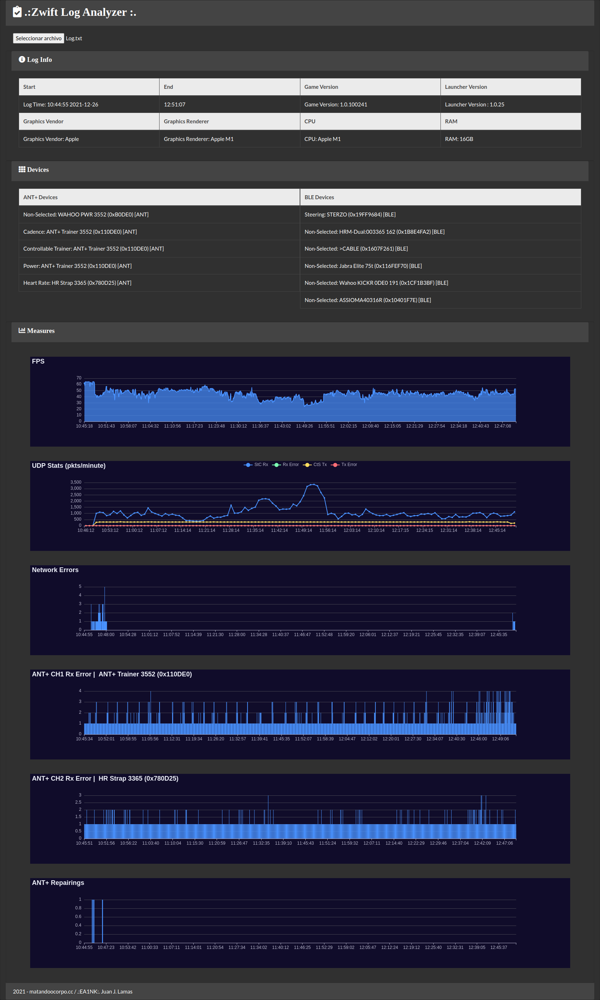

# ZwiftLogAnalyzer
  Sencillo analizador de logs de Zwift, alternativa a Zwiftalyzer
  
  Simple Zwift log analyzer, an alternative to Zwiftalyzer
  
## Características
- Todo el procesado se realiza en el lado del cliente (navegador web).
- No es necesario subir ningún fichero a ningún servidor, la información no se almacena.
- Puede funcionar offline.
## Characteristics
- All the processing is done at client side (web browser)
- No need to upload any file to a server, information is not stored.
- It can work offline!

## Instalación
  Descargar zip o: 
   ```
  git clone https://github.com/matandoocorpo/ZwiftLogAnalyzer.git
  ```
## Installation
  Download zip or:
   ```
  git clone https://github.com/matandoocorpo/ZwiftLogAnalyzer.git
  ```


2021-2022 matandoocorpo.cc 
